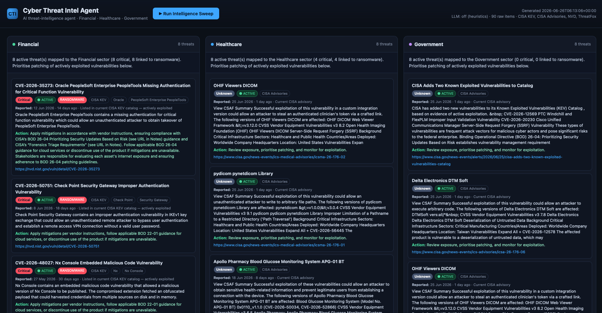

# Cyber Threat Intel Agent

An AI-agent application that, **when triggered**, fetches cyber threat
intelligence from reputable sources and presents it across three sector
dashboards: **Financial**, **Healthcare**, and **Government**.

It is built entirely on the Python standard library (no web framework) and
uses a **local Ollama model** for reasoning, so it runs offline with no API
keys and no cloud calls.

## Highlights

- 🔒 **Fully offline AI** — reasoning runs on a local Ollama model; no cloud,
  no API keys, nothing leaves your machine.
- 🤖 **Agentic pipeline** — *collect → classify → enrich → brief*, producing a
  per-sector executive summary and a recommended action per threat.
- 🎯 **Sector-aware** — maps live threats to **Financial**, **Healthcare**, and
  **Government**, each panel led by sector-specific intel.
- 🧱 **Dependency-free core** — pure Python standard library; degrades
  gracefully to keyword heuristics when the LLM is unavailable.
- 🛰️ **Reputable live sources** — CISA KEV, CISA Advisories, NVD, and (optional)
  abuse.ch ThreatFox, with each threat showing its reported date and active status.
- ☁️ **Run on demand** — locally, or one-click in **GitHub Codespaces**.

## Screenshot

<!-- Add a dashboard screenshot at docs/dashboard.png, then it shows here: -->


## What the agent does

The agent runs a multi-step pipeline on each sweep:

1. **Collect** — pulls live intel from reputable sources:
   - **CISA Known Exploited Vulnerabilities (KEV)** catalog — vulnerabilities
     confirmed to be actively exploited in the wild.
   - **CISA Cybersecurity Advisories** (RSS) — ICS/OT and product advisories.
   - **NIST NVD** — CVEs published in the last `CTI_NVD_DAYS` days, with real
     CVSS base severities.
   - **abuse.ch ThreatFox** — in-the-wild malware IOCs. Requires a free
     `Auth-Key`; **skipped gracefully** when `ABUSE_CH_KEY` is unset (so it
     never errors and never floods the panels with unmapped indicators).
2. **Classify** — maps each item to the sector(s) it threatens. A fast
   word-boundary keyword/vendor pre-pass handles obvious cases; the LLM resolves
   the rest in small batches. Within each panel, intel is ranked by relevance
   tier — **explicit sector keyword > LLM-judged relevant > broadly-critical
   fill** — then by *actively-exploited > severity > ransomware > recency*. So
   each panel leads with genuinely sector-specific intel, and actively-exploited
   critical threats still surface everywhere (no panel is starved).
3. **Enrich** — the LLM writes a one-sentence, sector-specific risk analysis
   and a concrete recommended action for each top threat.
4. **Brief** — the LLM writes a short executive briefing per sector.

Every LLM step **degrades gracefully**: if Ollama is unavailable, the agent
falls back to deterministic heuristics and source-provided remediation text, so
a sweep always returns useful output.

## Run it

```bash
cd "/Users/radium/ai projects/threat intel"
pip3 install -r requirements.txt   # first time only (certifi)
./run.sh                           # or: python3 -m cti_agent.server
# open http://127.0.0.1:8077  and click "Run Intelligence Sweep"
```

`run.sh` starts Ollama automatically (if installed) and falls back to
heuristics mode if it isn't.

A sweep with the LLM enabled takes a few minutes on a local CPU model.

### Run on demand in GitHub Codespaces

This repo ships a `.devcontainer`, so you can run the whole setup in the cloud
without installing anything locally:

1. On GitHub: **Code → Codespaces → Create codespace on main**.
2. Wait for setup (installs Python deps + Ollama, pulls the lightweight `phi3`
   model). The dashboard port (8077) auto-forwards.
3. In the Codespace terminal: `python3 -m cti_agent.server`, then open the
   forwarded **8077** URL and click **Run Intelligence Sweep**.
4. **Stop** (or delete) the Codespace when done — it also auto-stops when idle.

Codespaces are CPU-only, so LLM sweeps are slower there; for snappy testing use
heuristics mode: `CTI_LLM=0 python3 -m cti_agent.server`. The free tier
(120 core-hours/month) is ample for on-demand use.

### CLI / JSON

```bash
python3 -m cti_agent.agent            # run a sweep, print JSON to stdout
CTI_LLM=0 python3 -m cti_agent.agent  # heuristics only (fast, no model)
```

## Configuration (environment variables)

| Variable            | Default               | Purpose                                   |
|---------------------|-----------------------|-------------------------------------------|
| `CTI_MODEL`         | `llama3:latest`       | Ollama model for reasoning                |
| `OLLAMA_HOST`       | `http://localhost:11434` | Ollama endpoint                        |
| `CTI_LLM`           | `1`                   | Set `0` to disable the LLM (heuristics)   |
| `CTI_LLM_TIMEOUT`   | `60`                  | Per-LLM-call timeout (seconds)            |
| `CTI_MAX_KEV`       | `60`                  | Max recent KEV items to ingest            |
| `CTI_MAX_RSS`       | `40`                  | Max recent advisories to ingest           |
| `CTI_MAX_NVD`       | `50`                  | Max recent NVD CVEs to ingest             |
| `CTI_NVD_DAYS`      | `7`                   | NVD look-back window (days)               |
| `ABUSE_CH_KEY`      | _(unset)_             | abuse.ch Auth-Key; enables ThreatFox      |
| `CTI_MAX_PER_SECTOR`| `8`                   | Max threats shown per sector              |

## Layout

```
cti_agent/
  config.py    sectors, keyword maps, source URLs, LLM settings
  net.py       verified-TLS context + resilient HTTP GET/POST (urllib → curl fallback)
  sources.py   CISA KEV + CISA Advisories + NVD + ThreatFox fetchers (normalized)
  llm.py       Ollama client with graceful degradation
  agent.py     CTIAgent — collect → classify → enrich → brief
  server.py    stdlib dashboard + /api/sweep trigger
  preview.py   dev launcher that preloads a cached report
```

## Notes

- TLS verification stays **on**; the `certifi` CA bundle is used when present.
  CISA is fronted by a CDN that rejects stdlib `urllib` at the TLS-fingerprint
  level, so `net.py` transparently falls back to the system `curl`.
- Sources are public and unauthenticated. This is a **defensive** tool: it only
  reads and summarizes published threat data.
- **NVD is slow when keyless** — its public API is rate-limited and can take
  30–90 s. The agent gives it a longer timeout + retries and **skips it
  gracefully** if it still fails (the sweep always completes on CISA KEV +
  Advisories). For consistently fast sweeps, disable NVD with **`CTI_MAX_NVD=0`**.
